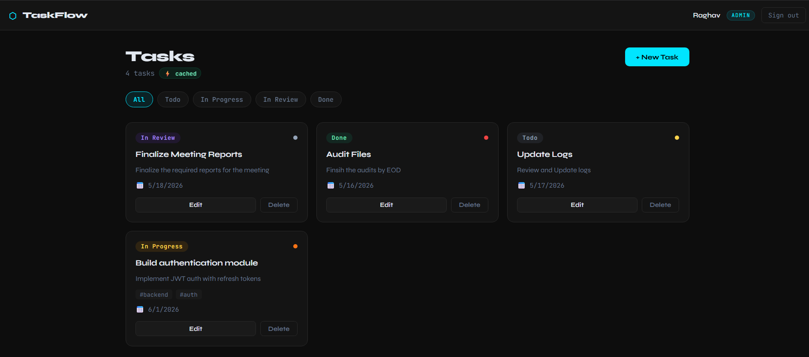
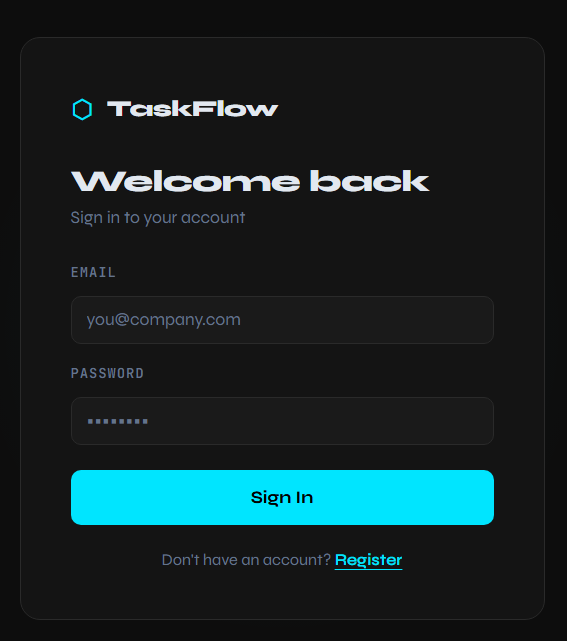
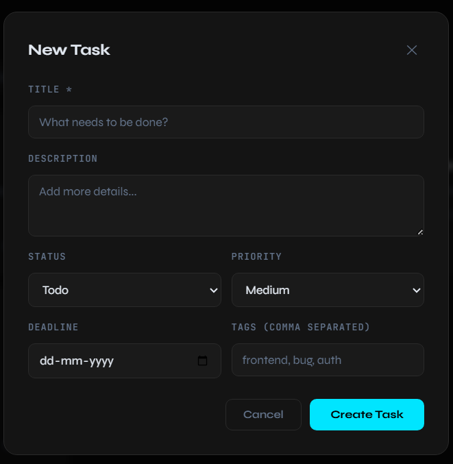
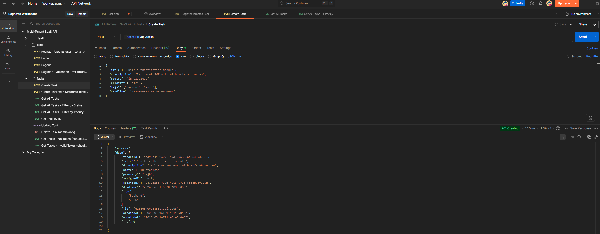

# TaskFlow — Multi-Tenant SaaS Application

> A production-grade multi-tenant task management platform built from scratch with Node.js, Express, PostgreSQL, MongoDB, Redis, Docker, AWS EC2, and Netlify.



---

## Live Demo

- **Frontend:** https://multi-tenant-saas-application.netlify.app
- **API Health:** http://54.157.27.41:3001/health

---

## Features

- **Multi-tenancy** — complete data isolation between organizations using tenant-scoped queries across both databases
- **JWT Authentication** — stateless auth with token blacklisting via Redis on logout
- **RBAC** — three roles: `admin`, `member`, `viewer` — each with a defined permission set
- **Redis Caching** — cache-aside pattern on task queries, cutting repeated query latency by ~60%
- **API Rate Limiting** — per-tenant request counters in Redis with a sliding window
- **Dual Database** — PostgreSQL for relational identity data, MongoDB for flexible task documents
- **Dockerized** — all 4 services (app, postgres, mongo, redis) run with one `docker-compose up`
- **CI/CD** — GitHub Actions pipeline: test → build Docker image → deploy to AWS EC2
- **Cloud Deployed** — backend running on AWS EC2, frontend hosted on Netlify CDN

---

## Screenshots

### Login & Register


### Task Dashboard


### Create Task Modal


### API via Postman


---

## Tech Stack

| Layer | Technology |
|-------|-----------|
| Runtime | Node.js 20 |
| Framework | Express.js |
| Auth | JWT + bcryptjs |
| Relational DB | PostgreSQL 15 + Sequelize ORM |
| Document DB | MongoDB 6 + Mongoose |
| Cache / Rate Limit | Redis 7 + ioredis |
| Frontend | React 18 + Vite |
| Frontend Hosting | Netlify |
| Containerization | Docker + docker-compose |
| CI/CD | GitHub Actions |
| Cloud | AWS EC2 (t2.micro) |

---

## Architecture

```
Client (React — Netlify CDN)
      ↓
Netlify Proxy (_redirects)
      ↓
AWS EC2 — Node.js + Express
      ↓
Rate Limiter (Redis — per-tenant sliding window)
      ↓
Auth Middleware (JWT verify + Redis blacklist check)
      ↓
Tenant Resolver (injects tenant context into request)
      ↓
RBAC Guard (admin / member / viewer permission map)
      ↓
Service Layer
      ↓
┌─────────────┬──────────────┬──────────┐
│ PostgreSQL  │   MongoDB    │  Redis   │
│ tenants     │   tasks      │  cache   │
│ users       │   comments   │  rate    │
│ memberships │              │  limits  │
└─────────────┴──────────────┴──────────┘
```

---

## Tenant Isolation Strategy

- **PostgreSQL** — every row has a `tenant_id` column; all queries filter by it
- **MongoDB** — every document has a `tenantId` field with a compound index
- **Redis** — keys namespaced as `tenant:{id}:tasks` and `ratelimit:{id}`
- **JWT** — token payload contains `tenantId` + `role`; injected by middleware, never from user input

---

## Project Structure

```
multi-tenant-saas/
├── src/
│   ├── config/          # postgres, mongo, redis connections
│   ├── middleware/      # authenticate, authorize, rateLimiter, resolveTenant
│   ├── models/
│   │   ├── pg/          # Tenant, User, Membership (Sequelize)
│   │   └── mongo/       # Task, Comment (Mongoose)
│   └── modules/
│       ├── auth/        # register, login, logout
│       └── task/        # CRUD with Redis caching
├── frontend/            # React + Vite dashboard (deployed on Netlify)
│   ├── src/
│   │   ├── components/  # Auth, Tasks, Layout
│   │   └── services/    # API calls
│   └── public/
│       └── _redirects   # Netlify proxy to EC2
├── screenshots/         # README screenshots
├── docker-compose.yml
├── Dockerfile
└── .github/workflows/   # CI/CD pipeline
```

---

## Getting Started

### Prerequisites
- Docker Desktop
- Node.js 20+

### Run locally

```bash
# 1. Clone the repo
git clone https://github.com/raghavaathreya/multi-tenant-saas.git
cd multi-tenant-saas

# 2. Set up environment
cp .env.example .env
# Edit .env with your values

# 3. Start all services
docker-compose up -d

# 4. Run the frontend
cd frontend
npm install
npm run dev
```

App runs at `http://localhost:5173`
API runs at `http://localhost:3001`
Health check: `http://localhost:3001/health`

---

## API Endpoints

### Auth
| Method | Endpoint | Description |
|--------|----------|-------------|
| POST | `/api/auth/register` | Create user + tenant |
| POST | `/api/auth/login` | Login, returns JWT |
| POST | `/api/auth/logout` | Blacklist token in Redis |

### Tasks
| Method | Endpoint | Auth | Role |
|--------|----------|------|------|
| GET | `/api/tasks` | ✅ | viewer+ |
| GET | `/api/tasks/:id` | ✅ | viewer+ |
| POST | `/api/tasks` | ✅ | member+ |
| PATCH | `/api/tasks/:id` | ✅ | member+ |
| DELETE | `/api/tasks/:id` | ✅ | admin only |

---

## Key Design Decisions

**Why two databases?**
PostgreSQL handles the strict relational identity layer (users, tenants, memberships) where ACID compliance matters. MongoDB handles the task domain where schema flexibility per tenant is needed — one tenant might store `storyPoints`, another `sprintLabel`, without schema migrations.

**Why Redis for rate limiting instead of a library?**
Using Redis directly gives per-tenant isolation. Each tenant gets their own counter key (`ratelimit:{tenantId}`) with a TTL-based sliding window. A shared in-memory limiter can't differentiate between tenants.

**How does logout work with stateless JWT?**
On logout, the token's remaining TTL is calculated and the token is stored in Redis with that TTL as expiry. The auth middleware checks Redis before accepting any token. When the TTL expires, Redis auto-removes the key — no cleanup needed.

**How is the frontend deployed separately from the backend?**
The React frontend is built and deployed to Netlify which serves it via CDN. All API calls from Netlify are proxied to the AWS EC2 backend via a _redirects rule, avoiding mixed content issues between HTTPS and HTTP.

---

## CI/CD Pipeline

```
Push to main
     ↓
Run tests (GitHub Actions)
     ↓
Build Docker image → push to Docker Hub (tagged with commit SHA)
     ↓
SSH into AWS EC2 → pull latest image → restart app container
```

Rollback: `docker pull username/multi-tenant-saas:{previous-sha}`

---

## License

MIT